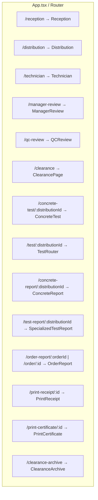
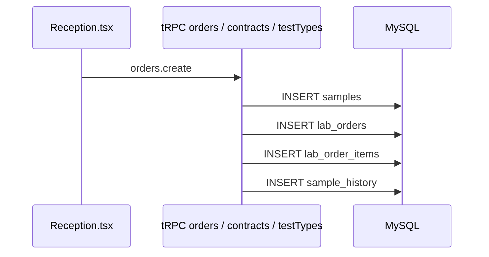
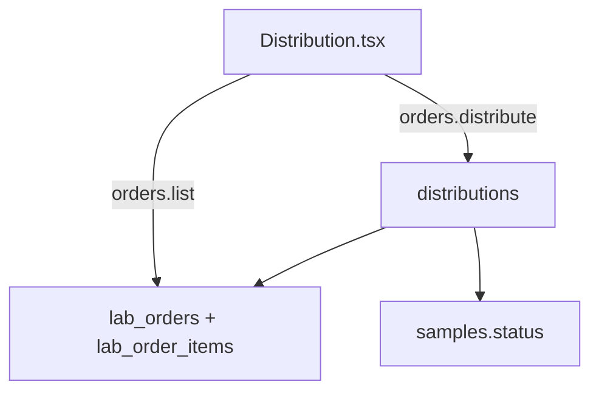
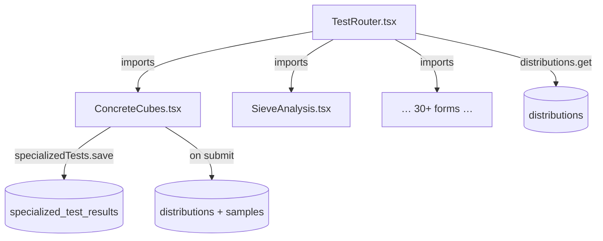
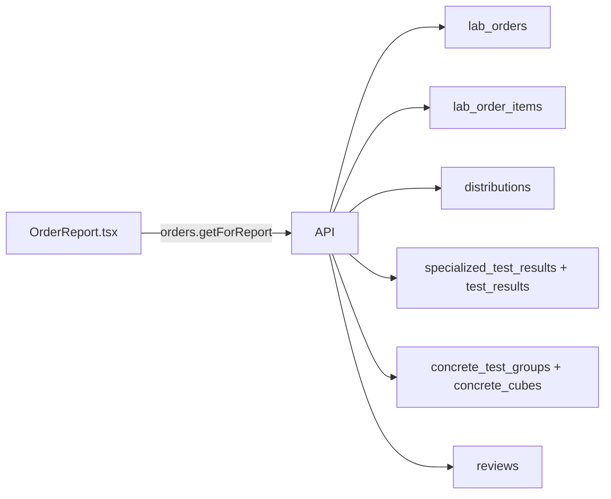
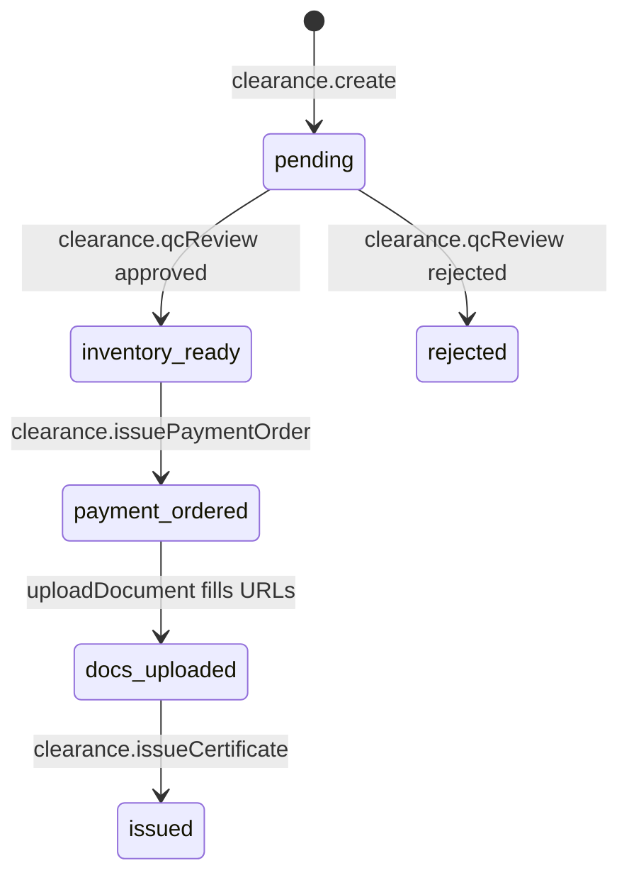

# Lab Management System — File & Data Flow Map

This document maps **current** connections between major UI surfaces (`client/src`), the **tRPC** API (`server/routers.ts` and merged routers), and **MySQL tables** defined in `drizzle/schema.ts`.  
Side effects such as rows in `notifications`, `sample_history`, and `audit_log` are noted where the router explicitly writes them.

---

## 1. Routing spine (`client/src/App.tsx`)

`App.tsx` mounts `Router` → `wouter` `Switch` / `Route` and lazy-loads page components. It **does not** call tRPC itself; each page imports `trpc` from `@/lib/trpc` and subscribes to procedures.

---

## 2. End-to-end domain flow (high level)

```mermaid
flowchart LR
  subgraph Reception["Reception"]
    A[orders.list, contracts.list, testTypes.list]
    B[orders.create, orders.update, orders.updateItemQty]
  end
  subgraph Distribution["Distribution"]
    C[orders.list, users.technicians]
    D[orders.distribute, orders.reassign]
  end
  subgraph Technician["Technician"]
    E[distributions.myAssignments, orders.myOrders, samples.list]
    F[distributions.markRead, testResults.submit]
  end
  subgraph Tests["Tests"]
    G[TestRouter → form *.tsx]
    H[specializedTests.get/save, distributions.get]
    I[ConcreteTest: concrete.*, distributions.get]
  end
  subgraph Reports["Reports"]
    J[SpecializedTestReport, ConcreteReport, OrderReport]
  end
  subgraph Review["Review chain"]
    K[ManagerReview: reviews.managerReview]
    L[QCReview: reviews.qcReview + clearance.*]
  end
  subgraph Clearance["Contract clearance"]
    M[ClearancePage: clearance.create → … → clearance.issueCertificate]
  end
  subgraph Certs["Sample certificate (legacy path)"]
    N[certificates.create / PrintCertificate]
  end

  Reception -->|samples + lab_orders + lab_order_items| Distribution
  Distribution -->|distributions + lab_orders| Technician
  Technician -->|navigate /test or /concrete-test| Tests
  Tests -->|specialized_test_results / test_results / concrete_*| Reports
  Tests --> Review
  Review --> Clearance
  Clearance -->|clearance_requests| Certs
```

---

## 3. Database tables (primary entities)

| Drizzle export | MySQL table |
|----------------|-------------|
| `users` | `users` |
| `samples` | `samples` |
| `labOrders` | `lab_orders` |
| `labOrderItems` | `lab_order_items` |
| `distributions` | `distributions` |
| `testResults` | `test_results` |
| `specializedTestResults` | `specialized_test_results` |
| `concreteTestGroups` | `concrete_test_groups` |
| `concreteCubes` | `concrete_cubes` |
| `reviews` | `reviews` |
| `certificates` | `certificates` |
| `clearanceRequests` | `clearance_requests` |
| `testTypes` | `test_types` |
| `contracts` / `contractors` / `sectors` | `contracts`, `contractors`, `sectors` |
| `notifications` | `notifications` |
| `sampleHistory` | `sample_history` |
| `auditLog` | `audit_log` |

---

## 4. Reception (`client/src/pages/Reception.tsx`)

| Caller → behavior | tRPC procedure | Primary tables touched |
|-------------------|----------------|------------------------|
| Page load | `orders.list` | `lab_orders`, `lab_order_items`, `samples`, `users` (join for tech name) |
| Page load | `contracts.list` | `contracts` |
| Page load | `testTypes.list` | `test_types` |
| Create intake | `orders.create` | **INSERT** `samples`; **INSERT** `lab_orders`; **INSERT** `lab_order_items`; **INSERT** `sample_history`; notifications |
| Edit order | `orders.update` | `lab_orders`, `lab_order_items` (implementation-dependent) |
| Line qty | `orders.updateItemQty` | `lab_order_items` |

---

## 5. Distribution (`client/src/pages/Distribution.tsx`)

| Caller → behavior | tRPC procedure | Primary tables touched |
|-------------------|----------------|------------------------|
| List work queue | `orders.list` | `lab_orders`, items, linked `samples` |
| Technicians | `users.technicians` | `users` |
| Assign lab order | `orders.distribute` | **INSERT** `distributions` (one per item); **UPDATE** `lab_order_items.distribution_id`; **UPDATE** `lab_orders` status + timestamps; **UPDATE** `samples.status`; history + notifications |
| Reassign / edit | `orders.reassign` | `lab_orders`, `distributions`, `lab_order_items` (per implementation in router) |

> Legacy path: `distributions.create` (lab manager–only) still exists in `server/routers.ts` for ad-hoc distribution rows; the **multi-test** UI is centered on `orders.distribute`.

---

## 6. Technician (`client/src/pages/Technician.tsx`)

| Caller → behavior | tRPC procedure | Primary tables touched |
|-------------------|----------------|------------------------|
| My tasks | `distributions.myAssignments` | `distributions` (by `assigned_technician_id`) |
| Multi-test orders | `orders.myOrders` | `lab_orders`, `lab_order_items` |
| Context | `samples.list` | `samples` |
| Acknowledge | `distributions.markRead` | `distributions` (read flag / task read helper) |
| Legacy cube MPa flow | `testResults.submit` | **INSERT** `test_results`; **UPDATE** `distributions`, `samples`; history, notifications, `audit_log` |

Navigation (not tRPC): links to `/test/:distributionId` (TestRouter) or `/concrete-test/:distributionId` (ConcreteTest) per assignment.

---

## 7. Test entry — router and forms

### 7.1 `TestRouter` (`client/src/pages/tests/TestRouter.tsx`)

| Caller → callee | tRPC | Tables |
|-----------------|------|--------|
| `TestRouter` → concrete/steel/soil/… form components (see `FORM_MAP` / `CODE_TO_COMPONENT` in file) | `distributions.get` | `distributions` (+ joined sample fields as returned by `getDistributionById`) |

**Form components** (examples: `ConcreteCubes.tsx`, `SieveAnalysis.tsx`, …) typically:

| Pattern | tRPC | Tables |
|---------|------|--------|
| Load assignment | `distributions.get` | `distributions` |
| Load draft | `specializedTests.getByDistribution` | `specialized_test_results` |
| Save / submit | `specializedTests.save` | **INSERT/UPDATE** `specialized_test_results`; on `status: "submitted"` → **UPDATE** `distributions`, `samples`; history; notifications; `audit_log` |

### 7.2 `ConcreteTest` (`client/src/pages/ConcreteTest.tsx`)

| tRPC | Tables |
|------|--------|
| `distributions.get` | `distributions` |
| `concrete.groupsByDistribution` | `concrete_test_groups`, `concrete_cubes` |
| `concrete.createGroup` | **INSERT** `concrete_test_groups` |
| `concrete.saveCube` / `deleteCube` | **INSERT/UPDATE/DELETE** `concrete_cubes` |
| `concrete.updateGroup` | **UPDATE** `concrete_test_groups` |
| `concrete.submitGroup` | **UPDATE** `concrete_test_groups` (status `submitted`); notifications (does **not** alone flip `distributions` to completed — that path is via `specializedTests.save` / `testResults.submit` for other flows) |

---

## 8. Reports

| File | tRPC used | Reads / writes |
|------|-----------|----------------|
| `client/src/pages/tests/SpecializedTestReport.tsx` | `specializedTests.getByDistribution`, `distributions.get`, `distributions.getByBatch`, `testResults.getByDistribution`, `specializedTests.getByBatch` | `specialized_test_results`, `distributions`, `test_results` |
| `client/src/pages/ConcreteReport.tsx` | `distributions.get`, `concrete.groupsByDistribution`, `testResults.getByDistribution` | `distributions`, `concrete_test_groups`, `concrete_cubes`, `test_results` |
| `client/src/pages/OrderReport.tsx` | `orders.getForReport` | `lab_orders`, `lab_order_items`, `samples`, `distributions`, `specialized_test_results`, `test_results`, `concrete_test_groups`, `concrete_cubes`, `reviews` |

---

## 9. Manager & QC review (sample-level)

### `ManagerReview.tsx`

| tRPC | Tables |
|------|--------|
| `samples.list` | `samples` |
| `testResults.bySample` | `test_results` |
| `specializedTests.getBySample` | `specialized_test_results` |
| `distributions.bySample` | `distributions` |
| `orders.bySample` | `lab_orders`, `lab_order_items` |
| `reviews.managerReview` | **INSERT** `reviews`; **UPDATE** `samples`, `test_results` and/or `specialized_test_results`; history; notifications |
| `reviews.markManagerRead` | `samples` (manager-read flags per service) |

### `QCReview.tsx`

Two parallel concerns:

1. **Sample QC** — `reviews.qcReview` mutates `reviews`, `samples`, result rows, notifications (mirror of manager path for QC decision).
2. **Contract clearance QC** — `clearance.list`, `clearance.getById`, `clearance.qcReview`, `clearance.markQcRead` → **`clearance_requests`** only (not `certificates` table).

---

## 10. Clearance (contract) vs sample certificate

### Contract clearance — `ClearancePage.tsx` (`/clearance`)

| tRPC | Tables / effect |
|------|-----------------|
| `clearance.list`, `clearance.getById`, `clearance.getArchive` | `clearance_requests` |
| `clearance.listSectors` | `sector_accounts` / sector helpers |
| `contracts.listSimple`, `contractors.list` | `contracts`, `contractors` |
| `clearance.create` | **INSERT** `clearance_requests` (inventory computed from `samples` + `distributions` + results + `test_types`); reads many tables; notifications |
| `clearance.qcReview` | **UPDATE** `clearance_requests` |
| `clearance.issuePaymentOrder` | **UPDATE** `clearance_requests` |
| `clearance.uploadDocument` | **UPDATE** `clearance_requests` (URL fields) |
| `clearance.issueCertificate` | **UPDATE** `clearance_requests` (`certificateCode`, `status: issued`, …) — **not** the `certificates` table |
| `clearance.saveReceiptNumber` | **UPDATE** `clearance_requests` |
| `clearance.markAccountantRead` | **UPDATE** `clearance_requests` |

### Per-sample lab certificate — `certificates` router

Used when QC has passed at **sample** level: `certificates.create` **INSERT** `certificates`, **UPDATE** `samples` to `clearance_issued`, history.  
`PrintCertificate.tsx` uses **`certificates.get`** for print layout.

This is **orthogonal** to contract-level `clearance.issueCertificate` (which only updates `clearance_requests`).

---

## 11. Print receipt

`PrintReceipt.tsx`: `samples.get`, `orders.bySample` → `samples`, `lab_orders` (+ items as implemented in `orders.bySample`).

---

## 12. How files “call” each other (summary)

| From | Calls / renders | Mechanism |
|------|-----------------|-----------|
| `App.tsx` | All top-level pages | `import` + `<Route component={…} />` |
| `TestRouter.tsx` | Each `pages/tests/*.tsx` form | static `import` + component map |
| `Technician.tsx` | Test URLs | `setLocation` / `<Link>` to `/test/:id` or `/concrete-test/:id` |
| `Distribution.tsx` | Same | usually after `orders.distribute` success |
| Form components | `SampleInfoCard`, UI primitives | React `import` (no tRPC inside card unless extended) |

---

## 13. tRPC index

Procedures referenced above live in **`server/routers.ts`** under keys: `orders`, `samples`, `contracts`, `contractors`, `testTypes`, `users`, `distributions`, `testResults`, `specializedTests`, `concrete`, `reviews`, `clearance`, `certificates`, plus `deletion`, `sector`, `dashboard`, etc. The app router merges **`deletionRouter`** from `server/routers/deletion.ts` for deletion-request flows (tables such as `deletion_requests` if present in migrations).

---

*Generated from codebase inspection (`App.tsx`, `TestRouter.tsx`, key pages, and `server/routers.ts`). For new procedures, grep `trpc.` under `client/src` and locate the matching `router({ … })` block in `server/routers.ts`.*
