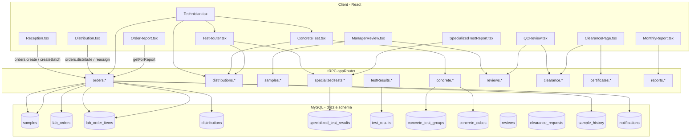
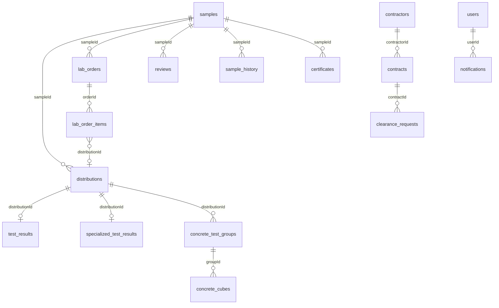

# Lab management system — file & data flow map

**Stack:** React (Vite) + Wouter + tRPC (`client/src/lib/trpc.ts` → `server/routers.ts`). **Schema:** `drizzle/schema.ts` (+ `drizzle/schema-deletion-requests.ts`).

**How to download this file:** It lives at `lab-management-system/docs/ARCHITECTURE-MAP.md`. In Cursor: right-click the file in the explorer → **Reveal in File Explorer**, then copy or zip. From GitHub/GitLab: open the file in the browser and use **Raw** → Save As.

---

## 1. Route → page (`client/src/App.tsx`)

| Path | Page file | Roles (when restricted) |
|------|-----------|-------------------------|
| `/` | `SmartHomeRedirect` (in `App.tsx`) | — |
| `/login` | `pages/Login.tsx` | Public (`fetch` → `/api/auth/local/*`, not tRPC) |
| `/reception` | `pages/Reception.tsx` | admin, reception, lab_manager |
| `/distribution` | `pages/Distribution.tsx` | admin, lab_manager |
| `/technician` | `pages/Technician.tsx` | admin, technician, lab_manager |
| `/manager-review` | `pages/ManagerReview.tsx` | admin, sample_manager, lab_manager |
| `/qc-review` | `pages/QCReview.tsx` | admin, qc_inspector, lab_manager |
| `/clearance` | `pages/ClearancePage.tsx` | admin, lab_manager, sample_manager, accountant |
| `/concrete-test/:distributionId` | `pages/ConcreteTest.tsx` | Protected (no route-specific role list) |
| `/test/:distributionId` | `pages/tests/TestRouter.tsx` | Protected |
| `/concrete-report/:distributionId` | `pages/ConcreteReport.tsx` | Public route |
| `/test-report/:distributionId` | `pages/tests/SpecializedTestReport.tsx` | Public |
| `/batch-report/:batchId` | `pages/tests/BatchBlockReport.tsx` | Public |
| `/order-report/:orderId`, `/order/:id` | `pages/OrderReport.tsx` | Protected |
| `/samples/:id`, `/sample/:id` | `pages/SampleDetail.tsx` | Protected |
| `/print-receipt/:id` | `pages/PrintReceipt.tsx` | Public |
| `/print-certificate/:id` | `pages/PrintCertificate.tsx` | Public |
| `/monthly-report` | `pages/MonthlyReport.tsx` | Protected |
| `/admin-dashboard` | `pages/AdminDashboard.tsx` | Protected |
| `/supervisor-dashboard` | `pages/SupervisorDashboard.tsx` | Protected |
| `/manager-dashboard` | `pages/ManagerDashboard.tsx` | Protected |
| `/sector/*` | `pages/sector/*.tsx` | Sector token (`localStorage.sector_token`) |

`TestRouter.tsx` maps `client/src/pages/tests/*` via `formTemplate` and test codes (`CODE_TO_COMPONENT`, `FORM_MAP`).

---

## 2. High-level flow

---

## 3. Reception → DB

| Caller | tRPC | Primary tables |
|--------|------|----------------|
| `Reception.tsx` | `orders.list` | `lab_orders`, `lab_order_items`, `samples`, `users` |
| | `contracts.list`, `testTypes.list`, `sectors.list` | `contracts`, `test_types`, `sectors` |
| | `orders.create`, `orders.createBatch` | `samples`, `lab_orders`, `lab_order_items`, `sample_history`, `notifications` |
| | `orders.update`, `orders.updateItemQty` | `lab_orders` / `samples`, `lab_order_items` |

---

## 4. Distribution → DB

| Caller | tRPC | Primary tables |
|--------|------|----------------|
| `Distribution.tsx` | `orders.list`, `users.technicians` | `lab_orders`, `users` |
| | `orders.distribute` | `distributions`, `lab_order_items`, `lab_orders`, `samples`, `sample_history`, `notifications` |
| | `orders.reassign` | `distributions`, `lab_orders`, `audit_log` |

---

## 5. Technician & tests → DB

| Caller | tRPC / nav | Primary tables |
|--------|------------|----------------|
| `Technician.tsx` | `distributions.myAssignments`, `orders.myOrders`, `samples.list`, `distributions.markRead`, `testResults.submit` | `distributions`, `lab_orders`, `samples`, `test_results` |
| | → `/concrete-test/:id` | `ConcreteTest.tsx` |
| | → `/test/:id` | `TestRouter.tsx` + forms |
| `ConcreteTest.tsx` | `distributions.get`, `concrete.*` | `concrete_test_groups`, `concrete_cubes`, `test_results`, `distributions`, `samples` |
| `pages/tests/*.tsx` | `distributions.get`, `specializedTests.getByDistribution`, `specializedTests.save` | `specialized_test_results`, `distributions`, `samples` |

---

## 6. Manager / QC → DB

| Caller | tRPC | Primary tables |
|--------|------|----------------|
| `ManagerReview.tsx` | `samples.*`, `testResults.bySample`, `specializedTests.getBySample`, `distributions.bySample`, `orders.bySample`, `reviews.managerReview`, `reviews.markManagerRead` | `samples`, `test_results`, `specialized_test_results`, `distributions`, `lab_orders`, `reviews` |
| `QCReview.tsx` | `clearance.*`, `reviews.qcReview`, sample/distribution queries | `clearance_requests`, `reviews`, … |
| `orders.review`, `orders.qcReview` (router) | | `lab_orders`, `samples`, `reviews`, `test_results` (backfill) |

---

## 7. Clearance & certificates → DB

| Caller | tRPC | Primary tables |
|--------|------|----------------|
| `ClearancePage.tsx` | `clearance.list`, `getById`, `create`, `qcReview`, `markAccountantRead`, `issuePaymentOrder`, `uploadDocument`, `issueCertificate`, `saveReceiptNumber`, `listSectors` | `clearance_requests` |
| | `contracts.listSimple`, `contractors.list` | `contracts`, `contractors` |
| `Clearance.tsx` | `certificates.list`, `certificates.create` | `certificates` |
| `PrintCertificate.tsx` | `certificates.get` | `certificates` |
| Sector pages | `sector.createClearanceRequest`, … | `clearance_requests`, `samples`, `distributions`, `sector_report_reads`, … |

---

## 8. Reports & analytics → DB

| Caller | tRPC | Primary tables |
|--------|------|----------------|
| `OrderReport.tsx` | `orders.getForReport` | `lab_orders`, `lab_order_items`, `samples`, `distributions`, `specialized_test_results`, `test_results`, `concrete_test_groups`, `concrete_cubes`, `reviews` |
| `ConcreteReport.tsx` | `distributions.get`, `concrete.groupsByDistribution`, `testResults.getByDistribution` | `distributions`, `concrete_*`, `test_results` |
| `SpecializedTestReport.tsx` | `specializedTests.*`, `distributions.get`, `getByBatch`, `testResults.getByDistribution` | `specialized_test_results`, `distributions`, `test_results` |
| `BatchBlockReport.tsx` | `specializedTests.getByBatch` | `specialized_test_results`, `distributions` |
| `MonthlyReport.tsx` | `reports.monthly`, `reports.monthlyPdf` | Aggregates: `lab_orders`, `clearance_requests`, `test_types`, … |
| `SampleDetail.tsx` | `samples.detail`, `history`, `distributions.bySample`, `testResults.bySample`, `reviews.bySample`, `generateSimplifiedReport`, `distributions.reassign` | `samples`, `sample_history`, `distributions`, `test_results`, `reviews` |
| `PrintReceipt.tsx` | `samples.get`, `orders.bySample` | `samples`, `lab_orders` |
| `Analytics.tsx` | `analytics.testStats` | Aggregates over `samples`, `distributions`, contracts, contractors |
| `ManagerDashboard.tsx` | `analytics.*`, `samples.*`, `orders.list`, `samples.dailyWork` | Multiple |
| `AdminDashboard.tsx`, `SupervisorDashboard.tsx` | `dashboard.*` | `samples`, `distributions`, `audit_log`, … (`server/routers/dashboard.ts`) |

---

## 9. Admin & deletion

| Caller | tRPC | Tables |
|--------|------|--------|
| `UserManagement.tsx` | `users.*` | `users`, `audit_log` |
| `TestTypesManagement.tsx` | `testTypes.*`, `contractors.*`, `contracts.*`, `sectors.*` | `test_types`, `contractors`, `contracts`, `sectors` |
| `AdminDeletionRequests.tsx`, deletion components | `deletion.*` | `deletion_requests`, targets via `deletionService` |

---

## 10. tRPC namespaces (`server/routers.ts`)

`system`, `auth`, `users`, `audit`, `samples`, `distributions`, `testResults`, `reviews`, `attachments`, `certificates`, `concrete`, `testTypes`, `contractors`, `contracts`, `specializedTests`, `clearance`, `analytics`, `sectors`, `orders`, `reports`, `notifications`, `dashboard`, `deletion`, `sector` (`server/routers/sector.ts`).

---

## 11. ER overview (core tables)

Also: `attachments`, `audit_log`, `sector_accounts`, `sector_report_reads`, `deletion_requests`.

---

## 12. Notes

- Many mutations touch several tables in one request via `server/db.ts`.
- Staff auth: `/api/auth/local/*` + session cookie; sector: Bearer token in `sectorRouter`.
